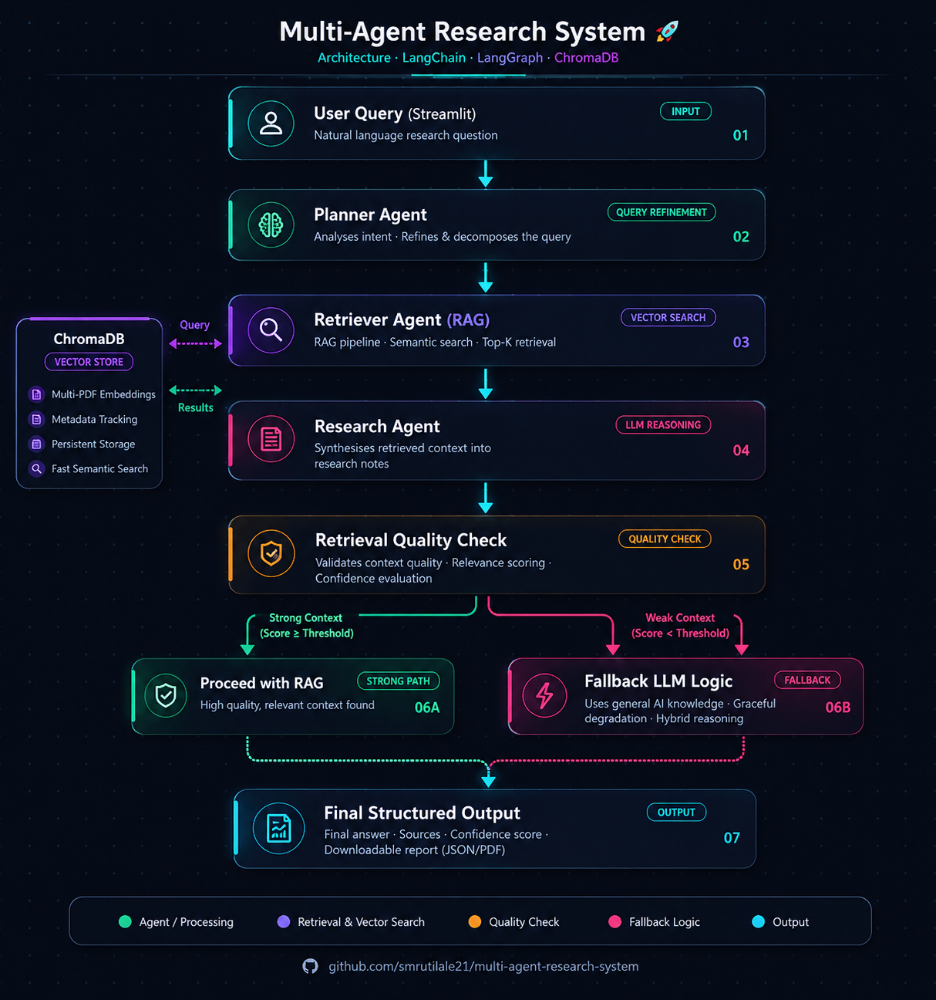
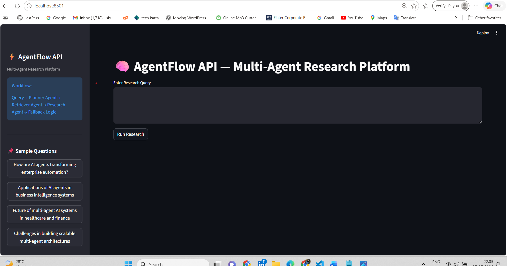
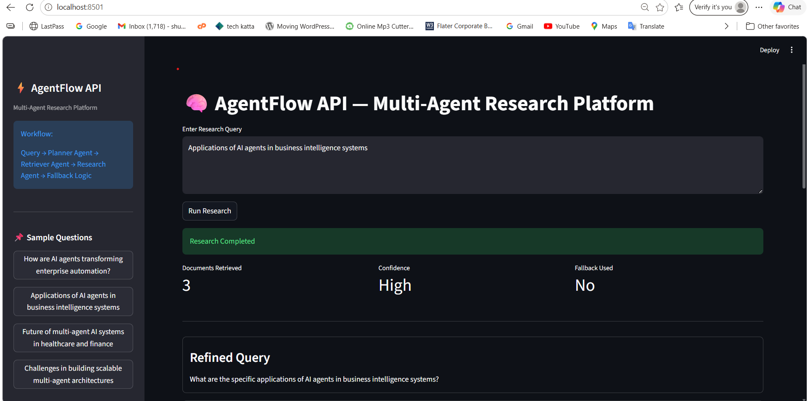
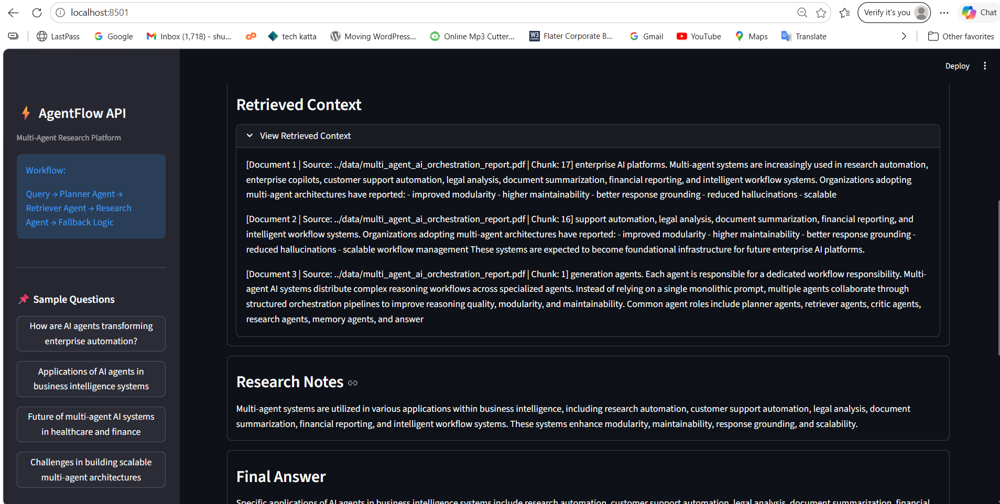
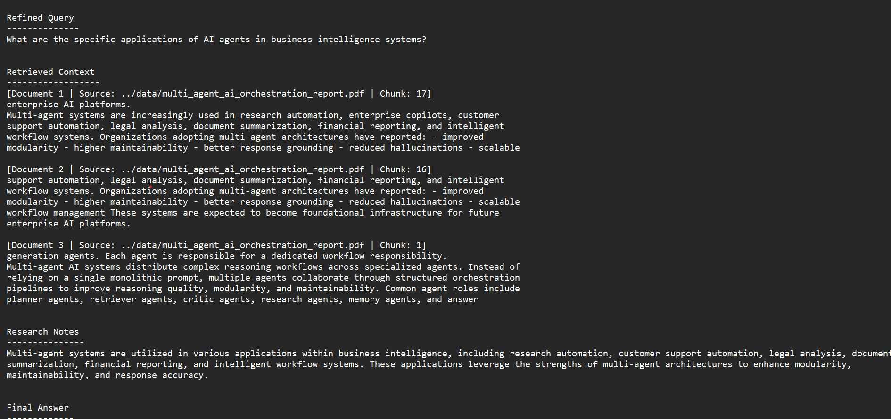
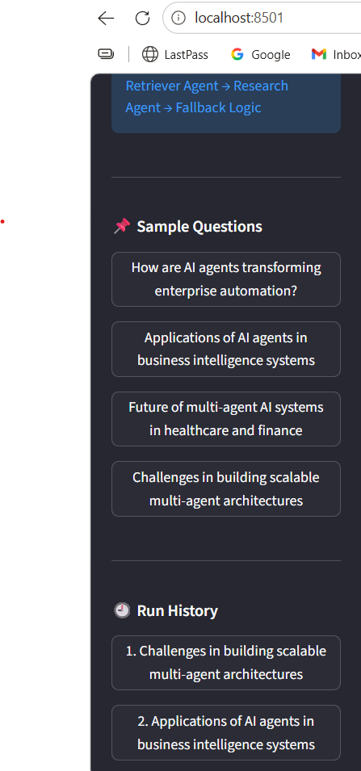

# 🧠 AgentFlow API — Multi-Agent Research Platform

A scalable multi-agent AI research platform built using FastAPI, LangGraph, RAG, OpenAI embeddings, and ChromaDB.

This system performs intelligent research using a structured multi-agent workflow and Retrieval-Augmented Generation (RAG), delivering context-aware and reliable responses through a maintainable API-first architecture.

The platform also includes hybrid RAG + LLM fallback handling, enabling graceful response generation even when retrieval quality is weak or insufficient.

---

# 🌐 Live Deployment

## Frontend (Streamlit)
https://agentflow-api-frontend.streamlit.app/

## Backend API (Render)
https://agentflow-api-backend.onrender.com/research

## Swagger API Docs
https://agentflow-api-backend.onrender.com/docs

---

# 🚀 Overview

This system uses a modular multi-agent architecture to process user research queries through multiple intelligent stages:

1. Planner Agent → Refines user query  
2. Retriever Agent → Performs semantic retrieval using ChromaDB  
3. Research Agent → Generates structured research notes  
4. Retrieval Quality Check → Detects weak retrieval scenarios  
5. Fallback Logic → Uses LLM general reasoning if retrieval is insufficient  
6. Final Response Generator → Produces final answer with confidence and sources  

The system is designed with:

- scalability
- observability
- structured outputs
- reliability
- modular AI architecture
- semantic retrieval pipelines

---

# 🏗️ Architecture Diagram



The system follows a modular multi-agent RAG architecture with:

- Streamlit Frontend
- FastAPI Backend
- LangGraph Workflow Engine
- Planner Agent
- Retriever Agent (RAG)
- Research Agent
- Retrieval Quality Validation
- Fallback LLM Logic
- Final Structured Output

The workflow supports semantic retrieval, multi-document reasoning, confidence-aware validation, and fallback response generation.

---


# 🧠 Core Features

## ✅ Multi-Agent Workflow

Built using LangGraph with modular agent orchestration and scalable workflow design.

---

## ✅ Multi-Document RAG Pipeline

Supports extensible semantic retrieval across multiple PDF documents using:

- ChromaDB
- OpenAI embeddings
- semantic vector search
- metadata-aware retrieval

The system automatically ingests multiple PDF knowledge sources and performs contextual retrieval across all documents.

---

## ✅ Hybrid RAG + LLM Fallback Architecture

Implements production-style fallback handling for weak retrieval scenarios.

If semantic retrieval does not contain sufficient context:

- retrieval quality is detected
- fallback reasoning is triggered
- LLM general knowledge is used
- graceful response generation is maintained

This prevents hard failures such as:

```text
"No relevant information found"
```

and creates a more reliable AI assistant experience.

---

## ✅ FastAPI Backend

Production-style backend architecture using FastAPI:

- REST API endpoints
- frontend/backend separation
- extensible deployment architecture
- API-first workflow design

---

## ✅ Structured Output Validation

Uses:

- Pydantic schemas
- JSON validation
- safe parsing utilities

to ensure reliable structured AI outputs.

---

## ✅ Retry Mechanism

Implements:

- retry with stricter prompts
- malformed JSON handling
- structured parsing recovery

for robust AI generation reliability.

---

## ✅ Logging & Observability

Includes:

- workflow logging
- centralized logger utilities
- debugging support
- error tracking

for production-style observability.

---

## ✅ Confidence-Aware Responses

The platform generates retrieval-aware confidence indicators based on:

- retrieval quality
- response grounding
- fallback usage
- structured validation

This creates more reliable and explainable AI outputs.

---

## ✅ Enhanced Frontend Experience

The Streamlit frontend includes:

- sample research questions
- workflow visualization
- run history tracking
- metrics dashboard
- fallback indicators
- downloadable research reports
- expandable retrieved context
- confidence visualization

for a cleaner and more professional product experience.

---

# 🌟 Highlights

- Designed modular multi-agent AI architecture
- Implemented robust multi-document RAG pipeline
- Added hybrid retrieval + fallback reasoning workflow
- Built semantic retrieval system using ChromaDB
- Integrated OpenAI embeddings for vector search
- Developed FastAPI backend for scalable API-first deployment
- Added confidence-aware response handling
- Implemented structured output validation and retries
- Added workflow observability through centralized logging
- Built interactive Streamlit research interface
- Created end-to-end AI research orchestration platform

---

# 🛠️ Tech Stack

- Python
- FastAPI
- Streamlit
- LangGraph
- LangChain
- ChromaDB
- OpenAI API
- Pydantic

---

# 📂 Project Structure

```text
agentflow-api/
│
├── backend/
│   ├── main.py
│   ├── graph.py
│   ├── nodes.py
│   ├── prompts.py
│   ├── retriever.py
│   ├── vector_store.py
│   ├── logger.py
│   ├── utils.py
│   ├── schemas.py
│   ├── state.py
│   ├── llm.py
│   ├── config.py
│   ├── requirements.txt
│   └── .env
│
├── frontend/
│   └── app.py
│
├── chroma_db/
├── logs/
├── data/
├── assets/
│
├── README.md
└── .gitignore
```

---

# 🧪 Example Queries

- What is RAG and how does it improve LLM performance?
- Explain how multi-agent AI systems work
- What are the risks of AI adoption in enterprises?
- How is generative AI used in customer support?
- Explain differences between vector databases and relational databases
- What are the challenges in large-scale multi-agent architectures?
- How do enterprise AI agent systems coordinate workflows?

---

# 🧪 Example Output

## Query

What is Retrieval-Augmented Generation?

---

## Answer

Retrieval-Augmented Generation (RAG) improves LLM performance by retrieving relevant external context before generating responses, reducing hallucinations and improving factual grounding.

---

## Confidence

High

---

## Sources

- Document 1
- Document 2

---

# 📸 Demo Screenshots

## 🏠 Home Screen



---

## 🔍 Sample Query & Output



---

## 📚 Retrieved Context



---

## 📄 Downloadable Research Report



---

## 🕘 Run History & Workflow Sidebar



---

# ⚙️ Local Setup

## 1️⃣ Clone Repository

```bash
git clone https://github.com/smrutilale21/agentflow-multi-agent-rag-system

cd agentflow-multi-agent-rag-system
```

---

## 2️⃣ Install Dependencies

```bash
pip install -r backend/requirements.txt
```

---

# 🔐 Environment Setup

Create `.env` inside backend folder:

```env
OPENAI_API_KEY=your_api_key_here
OPENAI_MODEL=gpt-4o-mini
```

---

# ▶️ Run Backend

```bash
cd backend

uvicorn main:app --reload
```

Backend runs at:

```text
http://127.0.0.1:8000
```

---

# ▶️ Run Frontend

```bash
cd frontend

streamlit run app.py
```

---

# 🌐 Deployment Architecture

| Layer | Platform |
|---|---|
| FastAPI Backend | Render |
| Streamlit Frontend | Streamlit Cloud |

---

# 🚀 Render Deployment

## Root Directory

```text
backend
```

---

## Start Command

```bash
uvicorn main:app --host 0.0.0.0 --port 10000
```

---

# 🚀 Streamlit Deployment

Add environment variable:

```text
BACKEND_URL=https://agentflow-api-backend.onrender.com/research
```

---

# ⚠️ Notes

- ChromaDB files are excluded from Git
- `.env` is ignored for security
- Logs are stored locally
- Frontend and backend are independently deployable
- Existing production workflow remains modular and extensible
- Multi-document ingestion is supported automatically
- Retrieval-aware fallback handling improves robustness

---

# 🔮 Future Improvements

- Retrieval reranking
- Streaming responses
- Dynamic PDF uploads
- Authentication system
- Redis caching
- Async background processing
- Advanced evaluation metrics
- React frontend migration

---

# 📌 Conclusion

AgentFlow API demonstrates a robust implementation of:

- multi-agent AI systems
- efficient RAG pipelines
- semantic vector retrieval
- hybrid retrieval + fallback reasoning
- FastAPI backend architecture
- structured AI outputs
- validation and retries
- confidence-aware AI responses
- scalable AI engineering workflows

This project showcases strong understanding of modern AI system design, retrieval engineering, production-oriented LLM architecture, and adaptive AI application development.